<h1 align="center">Complete DevOps Lifecycle: Enterprise Jitsi Meet on AWS EKS</h1>

<p align="center">
  <b>Production-grade WebRTC video conferencing — provisioned with Terraform, orchestrated on Kubernetes, delivered via GitOps, and monitored through Grafana.</b>
</p>

<p align="center">
  
  
  
  
  
  
</p>

---

## Table of Contents

| # | Section | Description |
|:--|:--------|:------------|
| 1 | [Project Overview](#1-project-overview) | Platform summary, capabilities, and technology stack |
| 2 | [Architecture at a Glance](#2-architecture-at-a-glance) | High-level system orientation diagram |
| 3 | [AWS Cloud Infrastructure](#3-aws-cloud-infrastructure) | VPC, EKS, IAM, and network topology |
| 4 | [Kubernetes Architecture](#4-kubernetes-architecture) | Namespace layout, services, ingress, and pod topology |
| 5 | [Jitsi Application Architecture](#5-jitsi-application-architecture) | Component roles, XMPP domains, and internal communication |
| 6 | [Traffic & Data Flow](#6-traffic--data-flow) | HTTPS, WebSocket signaling, and WebRTC media paths |
| 7 | [Infrastructure as Code](#7-infrastructure-as-code) | Terraform configuration, state management, and outputs |
| 8 | [Deployment Lifecycle](#8-deployment-lifecycle) | Automated deploy, pause, and destroy scripts |
| 9 | [CI/CD & GitOps](#9-cicd--gitops) | GitHub Actions pipelines and Argo CD continuous delivery |
| 10 | [Monitoring & Observability](#10-monitoring--observability) | Grafana, Loki, and OpenTelemetry log analysis |
| 11 | [Security Architecture](#11-security-architecture) | Network isolation, TLS, IAM, and secrets |
| 12 | [DNS & Load Balancing](#12-dns--load-balancing) | ACM certificates, ALB, and NLB configuration |
| 13 | [Verification & Product Showcase](#13-verification--product-showcase) | Live deployment evidence and smoke tests |
| 14 | [Troubleshooting & Engineering Challenges](#14-troubleshooting--engineering-challenges) | Real incidents encountered and resolutions |
| 15 | [Design Decisions & Lessons Learned](#15-design-decisions--lessons-learned) | Architectural rationale and key takeaways |
| 16 | [Production Recommendations](#16-production-recommendations) | Improvements for production readiness |
| 17 | [Project File Reference](#17-project-file-reference) | Complete repository structure and file purposes |

---

## 1. Project Overview

### 1.1 Platform Summary

This project delivers a **self-hosted, enterprise-grade video conferencing platform** built on the open-source [Jitsi Meet](https://jitsi.org/) stack. The infrastructure is fully automated — from bare AWS account to a running, monitored, GitOps-managed video conferencing service — using a single deployment script.

The platform runs four containerized microservices inside an Amazon EKS cluster, fronted by dual load balancers (ALB for HTTPS, NLB for UDP media), managed declaratively through Argo CD, and observed via Grafana dashboards backed by Loki log aggregation.

**Domain:** `yourdomain.com`
**Region:** `ap-south-1` (Mumbai)

### 1.2 Key Capabilities

| Capability | Implementation |
|:-----------|:---------------|
| **Video Conferencing** | Multi-participant WebRTC meetings with chat, screen sharing, and moderator controls |
| **Infrastructure as Code** | Full AWS infrastructure (VPC, EKS, ACM) provisioned via Terraform |
| **Container Orchestration** | Kubernetes (EKS v1.32) with Helm-based application deployment |
| **GitOps Delivery** | Argo CD auto-sync from `master` branch to cluster state |
| **CI/CD Pipelines** | GitHub Actions for Docker builds, infrastructure deployment, and teardown |
| **Observability** | Grafana + Loki + OpenTelemetry for per-component log dashboards |
| **Dual Load Balancing** | ALB (HTTPS/443) for web traffic, NLB (UDP/10000) for WebRTC media |
| **Cost Management** | Dedicated pause script to destroy expensive resources while preserving VPC |
| **One-Command Deploy** | Single `deploy.sh` script provisions entire stack end-to-end |

### 1.3 Technology Stack

| Layer | Technology | Version / Detail |
|:------|:-----------|:-----------------|
| Cloud Provider | AWS | `ap-south-1` |
| IaC | Terraform | >= 1.5.0, AWS provider >= 5.95.0 |
| Compute | Amazon EKS | v1.32 |
| Worker Nodes | EC2 (EKS Managed) | `m7i-flex.large`, AL2 x86_64 |
| Container Images | Jitsi Official | `jitsi/web:stable`, `jitsi/prosody:stable`, `jitsi/jicofo:stable`, `jitsi/jvb:stable` |
| Package Manager | Helm | v3.x |
| Load Balancing | AWS ALB + NLB | Via AWS Load Balancer Controller |
| TLS | AWS ACM | DNS-validated certificate |
| GitOps | Argo CD | v3.5.1 |
| CI/CD | GitHub Actions | 3 workflows (CI build, CD deploy, CD destroy) |
| Monitoring | Grafana | 10.2.0 |
| Log Aggregation | Grafana Loki | Via OpenTelemetry Collector |
| DNS | External registrar | CNAME to ALB endpoint |

---

## 2. Architecture at a Glance


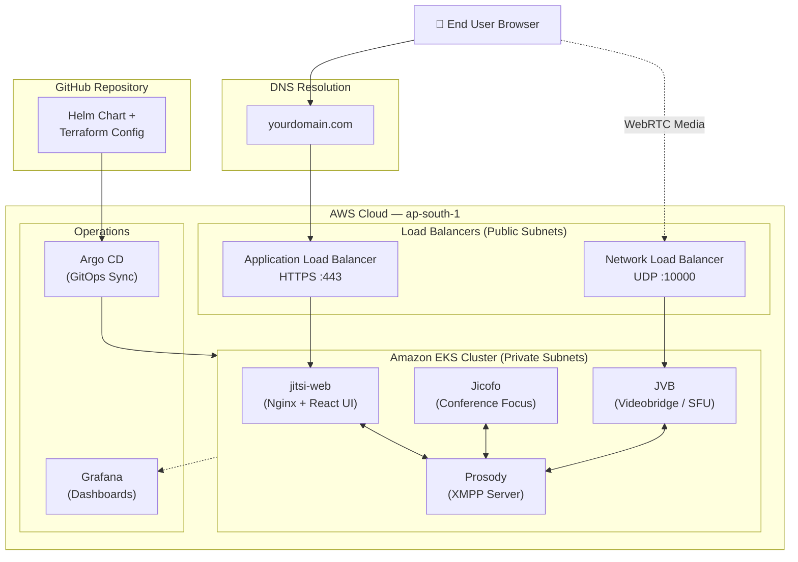

The system separates web/signaling traffic (Layer 7 via ALB) from real-time media traffic (Layer 4 via NLB). All Jitsi components run as Kubernetes Deployments inside private subnets, communicating internally over XMPP through the Prosody message bus.

---

## 3. AWS Cloud Infrastructure

### 3.1 VPC & Network Topology

> **Source:** [`jitsi-infra/terraform/vpc.tf`](jitsi-infra/terraform/vpc.tf)

The VPC is provisioned using the `terraform-aws-modules/vpc/aws` module (v5.19.x) with a `/16` address space distributed across three Availability Zones.

| Resource | Configuration |
|:---------|:-------------|
| VPC Name | `jitsi-production-vpc` |
| VPC CIDR | `10.0.0.0/16` |
| Availability Zones | `ap-south-1a`, `ap-south-1b`, `ap-south-1c` |
| Public Subnets | `10.0.101.0/24`, `10.0.102.0/24`, `10.0.103.0/24` |
| Private Subnets | `10.0.1.0/24`, `10.0.2.0/24`, `10.0.3.0/24` |
| NAT Gateway | Single (cost-optimized) |
| DNS Hostnames | Enabled |

**Subnet tagging** directs the AWS Load Balancer Controller to place public-facing load balancers in public subnets and internal load balancers in private subnets:

```hcl
# Public subnets — external-facing ALB/NLB placement
"kubernetes.io/role/elb" = "1"

# Private subnets — internal load balancer placement
"kubernetes.io/role/internal-elb" = "1"
```

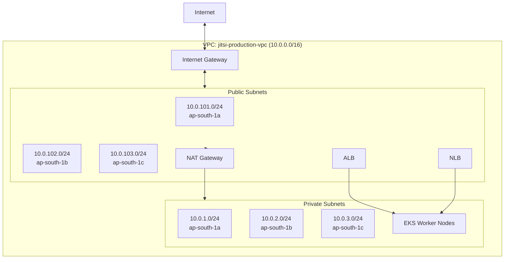

### 3.2 Amazon EKS Cluster

> **Source:** [`jitsi-infra/terraform/eks.tf`](jitsi-infra/terraform/eks.tf)

| Parameter | Value |
|:----------|:------|
| Cluster Name | `jitsi-eks-cluster` |
| Kubernetes Version | `1.32` |
| API Endpoint | Public access enabled |
| Node Placement | Private subnets only |
| CloudWatch Logs | Disabled (cost optimization) |
| KMS Encryption | Disabled (cost optimization) |

**Managed Node Group — `jitsi_nodes`:**

| Parameter | Value |
|:----------|:------|
| Instance Type | `m7i-flex.large` (2 vCPU, 8 GiB RAM) |
| AMI | Amazon Linux 2 (x86_64) |
| Capacity | ON_DEMAND |
| Min / Desired / Max | 1 / 2 / 3 |
| Max Pods Override | `110` (via `--kubelet-extra-args`) |
| Node Label | `role=jitsi-worker` |

The `--use-max-pods false --kubelet-extra-args '--max-pods=110'` bootstrap override is critical — it bypasses the default AWS ENI-based pod limit (which restricts smaller instances to as few as 4–11 pods) and allows up to 110 pods per node.

### 3.3 IAM & Security Boundaries

> **Source:** [`jitsi-infra/iam_policy.json`](jitsi-infra/iam_policy.json)

The AWS Load Balancer Controller requires IAM permissions to manage ALBs, NLBs, Target Groups, and Security Groups. These are provided through **IAM Roles for Service Accounts (IRSA):**

| Component | IAM Configuration |
|:----------|:-----------------|
| OIDC Provider | Associated with EKS cluster via `eksctl` |
| IAM Policy | `EKS_Combined_ALB_Route53_Policy` (263 lines) |
| IAM Role | `AmazonEKSLoadBalancerControllerRole` |
| K8s ServiceAccount | `aws-load-balancer-controller` in `kube-system` |

The policy grants permissions across four domains:
1. **EC2** — Security group management for load balancer targets
2. **Elastic Load Balancing** — Full ALB/NLB lifecycle management
3. **ACM / WAF / Shield** — Certificate binding and optional DDoS protection
4. **Route 53** — DNS record management for external-dns integration

---

## 4. Kubernetes Architecture

> **Source:** [`jitsi-infra/helm/jitsi-chart/templates/`](jitsi-infra/helm/jitsi-chart/templates/)

### 4.1 Namespace Layout

| Namespace | Purpose | Resources |
|:----------|:--------|:----------|
| `kube-system` | Cluster infrastructure | AWS Load Balancer Controller, CoreDNS, kube-proxy |
| `jitsi` | Application workloads | 4 Deployments, 3 Services, 1 Ingress |

### 4.2 AWS Load Balancer Controller

Installed via the `eks/aws-load-balancer-controller` Helm chart in `kube-system`. It watches for `Ingress` resources with `ingressClassName: alb` and `Service` resources with `type: LoadBalancer` annotations, then provisions the corresponding AWS load balancers automatically.

### 4.3 Services & Ingress


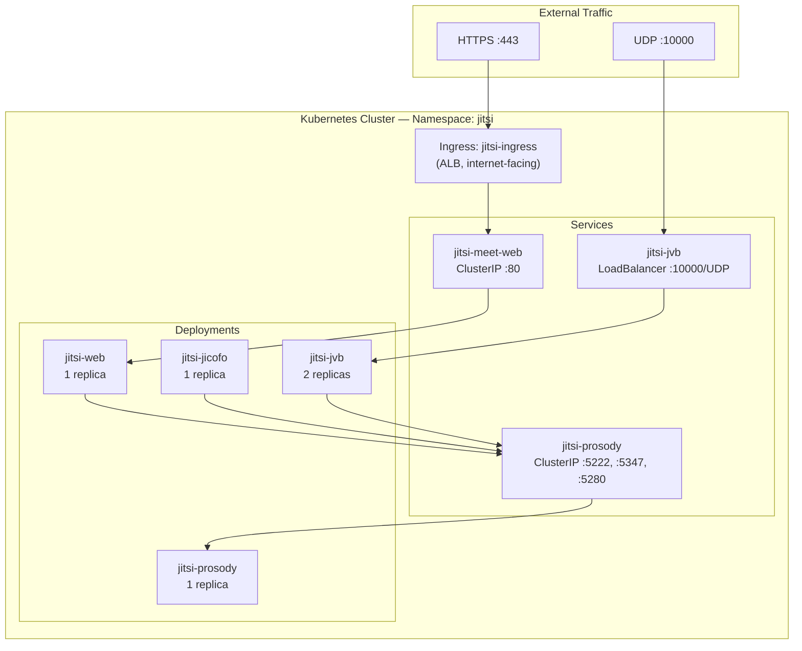

**Kubernetes Resource Inventory:**

| Resource | Name | Type | Port(s) | Source File |
|:---------|:-----|:-----|:--------|:------------|
| Ingress | `jitsi-ingress` | ALB (internet-facing, IP target) | 80 → 443 redirect | [`ingress.yaml`](jitsi-infra/helm/jitsi-chart/templates/ingress.yaml) |
| Service | `jitsi-meet-web` | ClusterIP | TCP 80 | [`web-deployment.yaml`](jitsi-infra/helm/jitsi-chart/templates/web-deployment.yaml) |
| Service | `jitsi-prosody` | ClusterIP | TCP 5222, 5347, 5280 | [`prosody-deployment.yaml`](jitsi-infra/helm/jitsi-chart/templates/prosody-deployment.yaml) |
| Service | `jitsi-jvb` | LoadBalancer (NLB, internet-facing, IP target) | UDP 10000 | [`jvb-service.yaml`](jitsi-infra/helm/jitsi-chart/templates/jvb-service.yaml) |
| Deployment | `jitsi-web` | 1 replica | Container: 80 | [`web-deployment.yaml`](jitsi-infra/helm/jitsi-chart/templates/web-deployment.yaml) |
| Deployment | `jitsi-prosody` | 1 replica | Container: 5222, 5347, 5280 | [`prosody-deployment.yaml`](jitsi-infra/helm/jitsi-chart/templates/prosody-deployment.yaml) |
| Deployment | `jitsi-jicofo` | 1 replica | — | [`jicofo-deployment.yaml`](jitsi-infra/helm/jitsi-chart/templates/jicofo-deployment.yaml) |
| Deployment | `jitsi-jvb` | 2 replicas | Container: UDP 10000 | [`jvb-deployment.yaml`](jitsi-infra/helm/jitsi-chart/templates/jvb-deployment.yaml) |

Both load balancers use **IP target-type** (`target-type: ip`), routing traffic directly to pod IPs within the VPC. This bypasses `kube-proxy` iptables rules, reducing latency — particularly important for real-time UDP media streams handled by JVB.

---

## 5. Jitsi Application Architecture

### 5.1 Component Overview

> **Reference architecture (official Jitsi Docker):**


The following table describes each component **as implemented** in this project:

| Component | Image | Role | Exposed Ports |
|:----------|:------|:-----|:-------------|
| **Jitsi Web** | `jitsi/web:stable` | Nginx-based frontend serving the React UI. Reverse-proxies BOSH/WebSocket connections to Prosody. | TCP 80 (container) |
| **Prosody** | `jitsi/prosody:stable` | XMPP server managing authentication, presence, chat rooms, and internal signaling between all components. | TCP 5222 (client XMPP), TCP 5347 (component), TCP 5280 (HTTP/BOSH/WebSocket) |
| **Jicofo** | `jitsi/jicofo:stable` | Conference Focus manager — allocates meeting rooms and assigns participants to JVB instances. | None (outbound-only client) |
| **JVB** | `jitsi/jvb:stable` | Jitsi Videobridge — the Selective Forwarding Unit (SFU) that routes WebRTC audio/video streams between participants without transcoding. | UDP 10000 (WebRTC media) |

**Components NOT deployed:** Jibri (recording), Jigasi (SIP gateway), and Otel/Loki are defined in the repository's Docker Compose files but are not part of the EKS Kubernetes deployment.

### 5.2 XMPP Domain Configuration

> **Source:** [`jitsi-infra/helm/jitsi-chart/values.yaml`](jitsi-infra/helm/jitsi-chart/values.yaml)

A critical aspect of this deployment is the **unified XMPP domain mapping**. All internal XMPP subdomains are derived from the public domain to prevent Prosody from rejecting internal traffic as unauthorized external server-to-server connections:

| Variable | Value | Purpose |
|:---------|:------|:--------|
| `domain` | `meet.hrnbyl.com` | Primary XMPP domain and public URL |
| `xmpp.authDomain` | `auth.meet.hrnbyl.com` | Authentication domain for Jicofo/JVB registration |
| `xmpp.mucDomain` | `muc.meet.hrnbyl.com` | Multi-User Conference (MUC) room domain |
| `xmpp.internalMucDomain` | `internal-muc.meet.hrnbyl.com` | Internal MUC for JVB health/brewery rooms |

### 5.3 Internal Communication Map

All internal service-to-service communication uses **Kubernetes Fully Qualified Domain Names (FQDNs)** to avoid DNS resolution failures in lightweight containers:


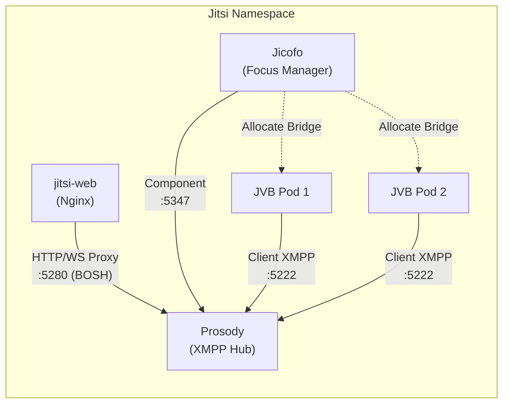

**Key environment variables injected into all deployments:**

| Variable | Value | Consumed By |
|:---------|:------|:------------|
| `XMPP_SERVER` | `jitsi-prosody.jitsi.svc.cluster.local` | Web, Jicofo, JVB |
| `XMPP_DOMAIN` | `meet.hrnbyl.com` | All |
| `XMPP_BOSH_URL_BASE` | `http://jitsi-prosody.jitsi.svc.cluster.local:5280` | Web |
| `ENABLE_XMPP_WEBSOCKET` | `1` | Web, Prosody |
| `PUBLIC_URL` | `https://meet.hrnbyl.com` | Web, Prosody |

---

## 6. Traffic & Data Flow

### 6.1 HTTPS Web Traffic

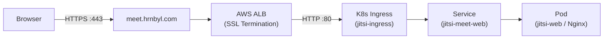

1. Browser resolves `meet.hrnbyl.com` via DNS CNAME to ALB hostname
2. ALB terminates TLS using the ACM certificate, redirects HTTP→HTTPS
3. ALB forwards decrypted HTTP/80 traffic to pod IPs (IP target-type)
4. Nginx serves the Jitsi Meet React application

### 6.2 XMPP Signaling (WebSocket / BOSH)

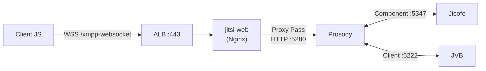

1. Client JavaScript opens a WebSocket to `/xmpp-websocket` over the existing HTTPS connection
2. Nginx inside `jitsi-web` reverse-proxies the WebSocket to Prosody on port **5280** (HTTP/BOSH listener)
3. Prosody manages the XMPP session — room creation, participant presence, and moderator controls
4. Jicofo receives conference events from Prosody and allocates JVB instances

### 6.3 WebRTC Media (UDP)

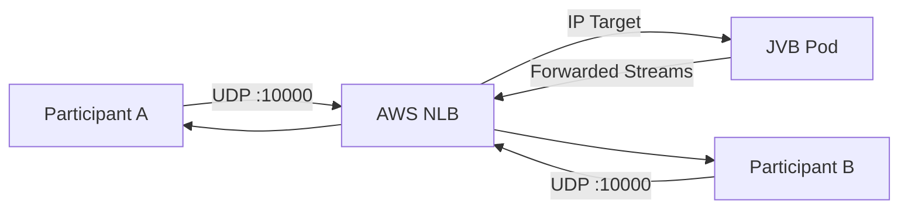

1. After signaling establishes a session, clients send/receive RTP media directly over UDP port 10000
2. The NLB passes UDP packets through to JVB pod IPs with zero protocol inspection (Layer 4)
3. JVB operates as a Selective Forwarding Unit — it receives each participant's stream and selectively forwards it to other participants without transcoding

### 6.4 Ports & Protocols Reference

| Source | Destination | Protocol | Port | Purpose |
|:-------|:------------|:---------|:-----|:--------|
| Browser | ALB | HTTPS | 443 | Web application + WebSocket signaling |
| ALB | jitsi-web Pod | HTTP | 80 | Decrypted web traffic |
| jitsi-web (Nginx) | Prosody | HTTP | 5280 | BOSH/WebSocket proxy |
| Jicofo | Prosody | XMPP | 5347 | Component connection (conference management) |
| JVB | Prosody | XMPP | 5222 | Client connection (bridge registration) |
| Browser | NLB | UDP | 10000 | WebRTC media streams |
| NLB | JVB Pod | UDP | 10000 | Media packet forwarding |
| EKS Nodes | Internet | TCP | 443 | Outbound via NAT Gateway (image pulls, API calls) |

---

## 7. Infrastructure as Code

### 7.1 Terraform File Map

> **Source:** [`jitsi-infra/terraform/`](jitsi-infra/terraform/)

| File | Purpose | Key Resources |
|:-----|:--------|:-------------|
| [`providers.tf`](jitsi-infra/terraform/providers.tf) | Provider configuration (AWS, Kubernetes, Helm) with EKS auth | AWS >= 5.95.0, K8s ~2.20, Helm ~2.10 |
| [`variables.tf`](jitsi-infra/terraform/variables.tf) | Input variables | `aws_region` (ap-south-1), `cluster_name`, `vpc_cidr` |
| [`vpc.tf`](jitsi-infra/terraform/vpc.tf) | VPC module with subnet tagging | VPC, 6 subnets, NAT Gateway, IGW |
| [`eks.tf`](jitsi-infra/terraform/eks.tf) | EKS cluster and managed node group | Cluster v1.32, `m7i-flex.large` nodes |
| [`dns.tf`](jitsi-infra/terraform/dns.tf) | ACM certificate request | SSL cert for `meet.hrnbyl.com` (DNS validation) |
| [`output.tf`](jitsi-infra/terraform/output.tf) | Terraform outputs | `cluster_endpoint`, `cluster_name`, `vpc_id` |
| [`backend.tf`](jitsi-infra/terraform/backend.tf) | Remote state configuration | S3 backend with encryption |

### 7.2 State Management

Terraform state is stored remotely in S3 with encryption enabled:

```hcl
backend "s3" {
  bucket  = "jitsimeet-terraform-state-12345"
  key     = "jitsi/terraform.tfstate"
  region  = "ap-south-1"
  encrypt = true
}
```

### 7.3 Terraform Outputs

| Output | Description | Consumer |
|:-------|:-----------|:---------|
| `cluster_endpoint` | EKS API server URL | `kubectl`, Helm provider |
| `cluster_name` | `jitsi-eks-cluster` | `aws eks update-kubeconfig` |
| `vpc_id` | VPC resource identifier | Reference / debugging |
| `acm_certificate_arn` | SSL certificate ARN | Helm `values.yaml` → Ingress annotation |
| `domain_validation_options` | CNAME records for ACM DNS validation | Manual DNS setup at registrar |

---

## 8. Deployment Lifecycle

### 8.1 Automated Deployment (`deploy.sh`)

> **Source:** [`deploy.sh`](deploy.sh)

The deployment script executes 6 stages in sequence:

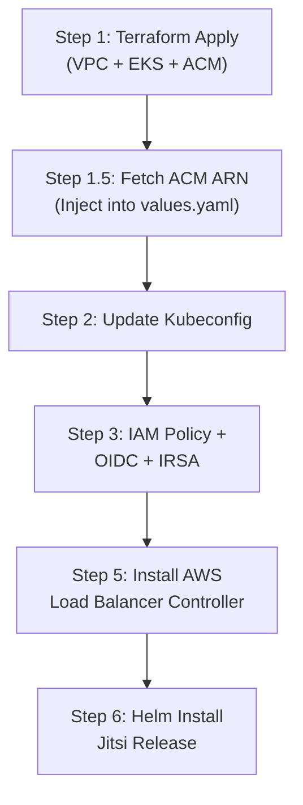

| Stage | Command | What It Creates |
|:------|:--------|:---------------|
| 1 | `terraform apply -auto-approve` | VPC, EKS cluster, ACM certificate |
| 1.5 | `aws acm list-certificates` + `sed` injection | Injects live certificate ARN into Helm values |
| 2 | `aws eks update-kubeconfig` | Local kubectl authentication |
| 3–4 | `eksctl` OIDC + `iamserviceaccount` | IRSA binding for Load Balancer Controller |
| 5 | `helm upgrade --install aws-load-balancer-controller` | ALB/NLB provisioning controller |
| 6 | `helm upgrade --install jitsi-release` | All Jitsi workloads + Services + Ingress |

**DNS validation pause:** After Terraform creates the ACM certificate, the script pauses for 60 seconds and displays the CNAME validation records. These must be added to the DNS registrar to complete certificate issuance.

### 8.2 Cost-Saving Pause (`pause.sh`)

> **Source:** [`pause.sh`](pause.sh)

Destroys the expensive resources (EKS control plane, EC2 nodes, NAT Gateway) while **preserving the VPC and Terraform state** for rapid redeployment:

```bash
# Targeted destruction — keeps VPC intact
terraform destroy -target="module.eks" -auto-approve
terraform destroy -target="module.vpc.aws_nat_gateway.this" \
                  -target="module.vpc.aws_eip.nat" -auto-approve
```

To resume: re-run `deploy.sh`. Terraform detects the existing VPC and only provisions the missing EKS and NAT resources.

### 8.3 Full Teardown (`destroy-all.sh`)

> **Source:** [`destroy-all.sh`](destroy-all.sh)

Performs a complete infrastructure nuke in 6 stages:

1. Uninstall Helm releases and delete all Kubernetes resources (triggers AWS LB deletion)
2. Uninstall AWS Load Balancer Controller
3. Wait 60 seconds for AWS to detach ENIs
4. `terraform destroy -auto-approve`
5. **Fail-safe VPC cleanup** — iterates all non-default VPCs and force-deletes ghost ENIs, security groups, subnets, IGWs, and the VPC itself
6. Delete IAM policy, CloudWatch log group, and local Terraform state files

The fail-safe loop exists because AWS Load Balancer-managed ENIs can sometimes outlive `terraform destroy`, blocking VPC deletion.

---

## 9. CI/CD & GitOps

### 9.1 GitHub Actions Pipelines

> **Source:** [`.github/workflows/`](.github/workflows/)

| Workflow | Trigger | Purpose |
|:---------|:--------|:--------|
| [`ci-build.yml`](.github/workflows/ci-build.yml) | Push to `master` | Builds `web` Docker image, pushes to Docker Hub |
| [`cd-deploy.yml`](.github/workflows/cd-deploy.yml) | Push to `master` (path: `jitsi-infra/terraform/**`) or manual dispatch | Full infrastructure deployment + Helm install |
| [`cd-destroy.yml`](.github/workflows/cd-destroy.yml) | Manual dispatch only | Complete infrastructure teardown |

The CD deploy workflow also **commits the updated ACM certificate ARN back to the repository**, ensuring the Git state always reflects the live infrastructure — a prerequisite for Argo CD synchronization.

### 9.2 Argo CD Continuous Delivery

> **Implemented.** Argo CD v3.5.1 is deployed and configured to manage the Jitsi application lifecycle.

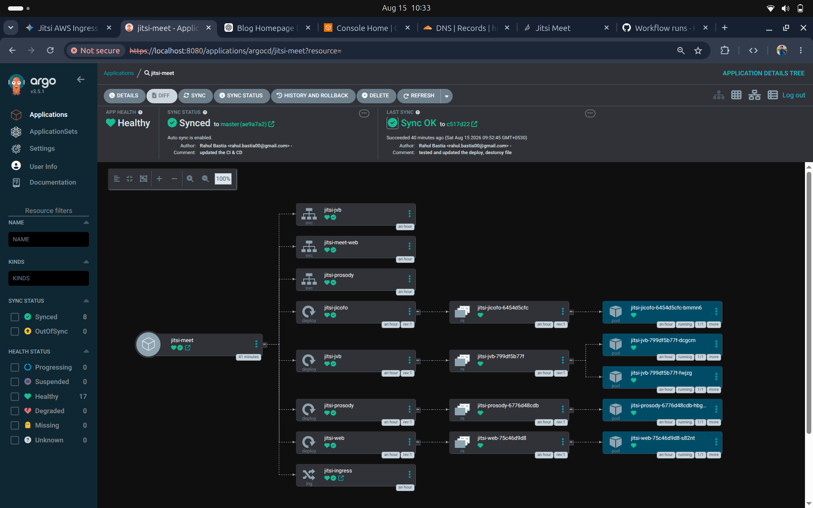

**Argo CD Application State (from screenshot evidence):**

| Property | Value |
|:---------|:------|
| Application Name | `jitsi-meet` |
| Health Status | ❤️ **Healthy** |
| Sync Status | ✅ **Synced** to `master` (`ae9a7a2`) |
| Auto Sync | **Enabled** |
| Last Sync | Sync OK to commit `c517d22` — "tested and updated the deploy, destroy file" |
| Total Resources | **17 Healthy**, 8 Synced, 0 OutOfSync |

**Managed Resources visible in the Argo CD resource tree:**

| Kind | Resources |
|:-----|:----------|
| Services | `jitsi-jvb`, `jitsi-meet-web`, `jitsi-prosody` |
| Deployments | `jitsi-jicofo`, `jitsi-jvb`, `jitsi-prosody`, `jitsi-web` |
| ReplicaSets | 4 (one per deployment) |
| Pods | 5 total (`jicofo` ×1, `jvb` ×2, `prosody` ×1, `web` ×1) — all `Running 1/1` |
| Ingress | `jitsi-ingress` |

### 9.3 GitOps Workflow

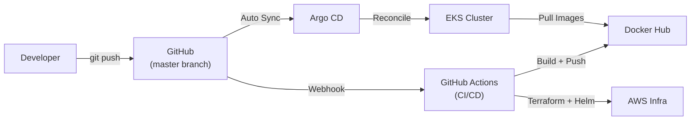

> **Note:** The Argo CD `Application` resource was configured via the Argo CD UI/CLI, not through a declarative manifest in the repository.

---

## 10. Monitoring & Observability

### 10.1 Observability Stack

> **Source:** [`grafana.yml`](grafana.yml), [`log-analyser/`](log-analyser/)

The monitoring pipeline uses a **log-based observability** approach:

| Component | Role | Configuration |
|:----------|:-----|:-------------|
| **Docker JSON Log Driver** | Captures container stdout/stderr as structured JSON | Configured per container in `docker-compose.yml` |
| **OpenTelemetry Collector** | Collects, parses, and forwards logs | [`log-analyser/otel-collector-config.yaml`](log-analyser/otel-collector-config.yaml) |
| **Grafana Loki** | Log aggregation and indexing backend | [`log-analyser/loki/`](log-analyser/loki/) |
| **Grafana 10.2.0** | Dashboard visualization | [`grafana.yml`](grafana.yml), pre-provisioned dashboards |

**Pre-provisioned dashboards** (auto-loaded via Grafana provisioning):

| Dashboard File | Component | Metrics |
|:---------------|:----------|:--------|
| `jicofo.json` | Jicofo | Conference requests, member events, log levels, error rates |
| `jvb.json` | JVB | MUC conference activity, log volume, log level distribution |
| `jitsi-web.json` | Jitsi Web | HTTP status codes, request counts, ELB health checks |
| `Prosody-Dashboard.json` | Prosody | Rooms started, clients connected/disconnected, log levels |
| `jitsi-all.json` | All Components | Unified overview |
| `docker-statistics.json` | Docker | Container-level resource statistics |

### 10.2 Grafana Dashboards

#### Jicofo Dashboard


The Jicofo dashboard monitors the **conference orchestration layer**:

- **Jicofo Logs** — Real-time log stream showing room allocations at `room=test@muc.meet.hrnbyl.com` with `AutoOwnerRoleManager` events, confirming active conference management
- **Log Levels Pie Chart** — 100% INFO indicates stable operation with no error conditions
- **Jicofo Log Levels Bar Chart** — Rate of 0.647 log events, showing healthy but not excessive logging
- **Number of Conference Requests** — Time-series graph with visible spikes corresponding to meeting creation events
- **Total Member Left/Terminating/Removed** — Gauge reading 41 over the observation period, reflecting cumulative participant lifecycle events

#### JVB Dashboard

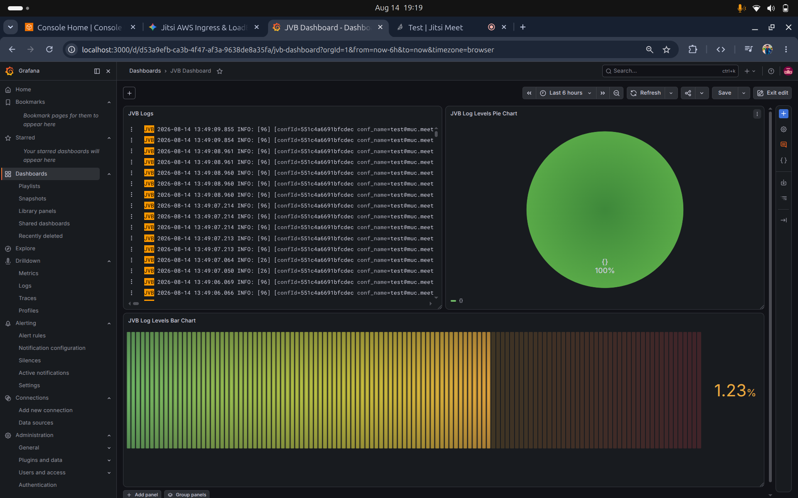

The JVB dashboard monitors the **media routing engine**:

- **JVB Logs** — Conference activity logs showing `conf_name=test@muc.meet` entries, confirming active WebRTC media routing
- **Log Levels Pie Chart** — 100% INFO (category `()`) confirming the videobridge is operating without errors
- **Log Levels Bar Chart** — 1.23% rate indicator showing log volume distribution across severity levels
- Logs are tagged with conference IDs (`conf=551c4a66691bfcdec`), enabling per-conference troubleshooting

#### Jitsi Web Dashboard

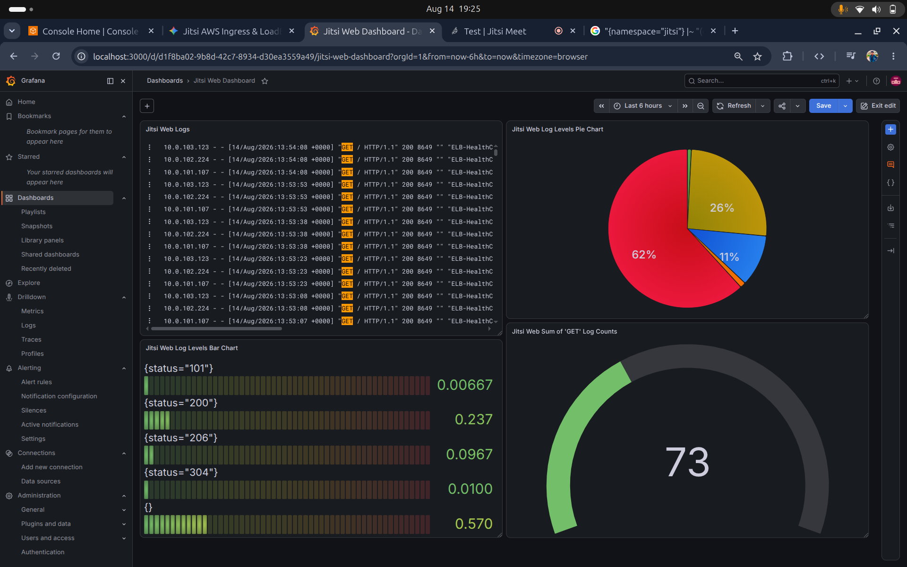

The Web dashboard monitors the **Nginx frontend gateway**:

- **Jitsi Web Logs** — Nginx access logs showing `GET / HTTP/1.1" 200 8649 "" "ELB-HealthChecker/2.0"` entries from ALB health probes across all three public subnet IPs (`10.0.101.x`, `10.0.102.x`, `10.0.103.x`)
- **Log Levels Pie Chart** — Status code distribution: 62% (200 OK), 26% (other success), 11% (informational)
- **Log Levels Bar Chart** — Breakdown by HTTP status: `101` (WebSocket upgrades), `200`, `206`, `304` (cached), confirming healthy request patterns
- **Sum of GET Log Counts** — 73 total requests in the observation window

#### Prosody Dashboard

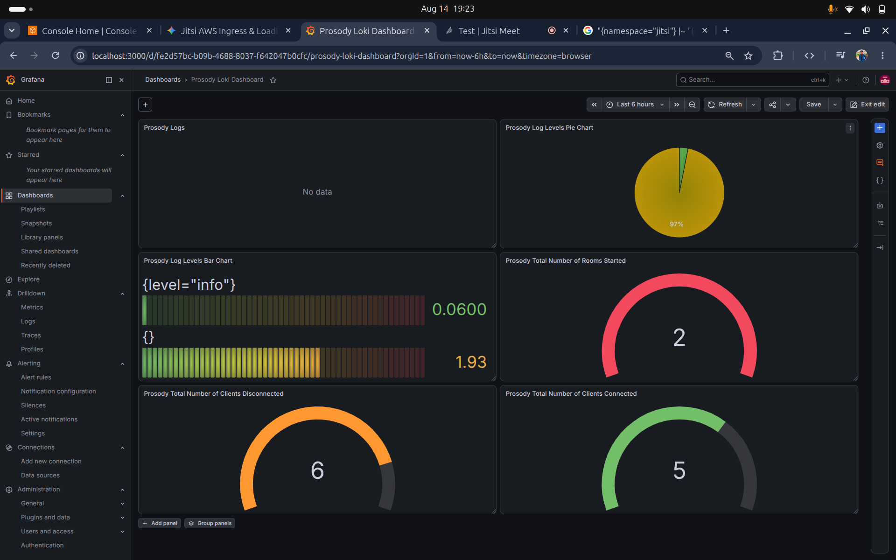

The Prosody dashboard monitors the **XMPP messaging backbone**:

- **Prosody Log Levels Pie Chart** — 97% INFO, indicating stable XMPP operations
- **Total Number of Rooms Started** — Gauge reading **2**, confirming conference room creation is functioning
- **Total Number of Clients Disconnected** — Gauge reading **6**, showing normal participant disconnection lifecycle
- **Total Number of Clients Connected** — Gauge reading **5**, confirming active XMPP client sessions during the observation window
- **Log Levels Bar Chart** — Two categories: `level="info"` (0.06 rate) and unlabeled (1.93 rate)

---

## 11. Security Architecture

### 11.1 Network Isolation

| Boundary | Implementation |
|:---------|:-------------|
| **Public Internet → VPC** | Traffic enters only through IGW to public subnets |
| **Public → Private Subnets** | EKS worker nodes have NO public IPs. Reachable only via load balancer target routing |
| **Private → Internet** | Outbound only via single NAT Gateway (for image pulls, AWS API calls) |
| **Prosody / Jicofo** | NOT externally exposed. Only reachable via ClusterIP services within the cluster |

### 11.2 TLS Termination & Certificates

> **Source:** [`jitsi-infra/terraform/dns.tf`](jitsi-infra/terraform/dns.tf)

| Property | Value |
|:---------|:------|
| Certificate Domain | `meet.hrnbyl.com` |
| Validation Method | DNS (CNAME record at registrar) |
| Managed By | AWS Certificate Manager (ACM) |
| Termination Point | ALB (SSL offloaded before reaching pods) |
| Internal Traffic | Unencrypted HTTP within VPC (pod-to-pod) |

### 11.3 IAM Least Privilege (IRSA)

Instead of attaching broad IAM policies to EC2 instance roles (which would grant permissions to ALL pods on the node), this project uses **IAM Roles for Service Accounts (IRSA)**:

1. EKS OIDC identity provider is associated with the cluster
2. A dedicated IAM role (`AmazonEKSLoadBalancerControllerRole`) is created
3. The role is bound exclusively to the `aws-load-balancer-controller` ServiceAccount in `kube-system`
4. Only pods running under that ServiceAccount can assume the IAM role

### 11.4 Secrets Management

> **⚠️ Current State:** XMPP shared secrets (`JICOFO_COMPONENT_SECRET`, `JICOFO_AUTH_PASSWORD`, `JVB_AUTH_PASSWORD`) are stored as plaintext values in `values.yaml` and injected as environment variables.

> **Recommended:** Migrate secrets to Kubernetes `Secret` resources, referenced via `secretKeyRef` in deployment templates. For production, integrate with AWS Secrets Manager via the CSI Secrets Store driver.

---

## 12. DNS & Load Balancing

### 12.1 DNS Resolution Path

```
meet.hrnbyl.com
  → CNAME → ALB hostname (k8s-jitsi-jitsiing-*.ap-south-1.elb.amazonaws.com)
  → ALB resolves to public IP in ap-south-1 AZs
```

The ACM certificate is provisioned by Terraform (`dns.tf`) and validated via a DNS CNAME record added at the domain registrar. The Ingress annotation `external-dns.alpha.kubernetes.io/hostname: meet.hrnbyl.com` is present for potential ExternalDNS integration.

### 12.2 Application Load Balancer (ALB)

> **Source:** [`jitsi-infra/helm/jitsi-chart/templates/ingress.yaml`](jitsi-infra/helm/jitsi-chart/templates/ingress.yaml)

| Property | Configuration |
|:---------|:-------------|
| Scheme | `internet-facing` |
| Target Type | `ip` (direct pod routing) |
| Listen Ports | HTTP 80 + HTTPS 443 |
| SSL Redirect | Enabled (80 → 443) |
| Certificate | ACM ARN injected from Terraform output |
| Ingress Class | `alb` |
| Host Rule | `meet.hrnbyl.com` → `jitsi-meet-web:80` |

### 12.3 Network Load Balancer (NLB)

> **Source:** [`jitsi-infra/helm/jitsi-chart/templates/jvb-service.yaml`](jitsi-infra/helm/jitsi-chart/templates/jvb-service.yaml)

| Property | Configuration |
|:---------|:-------------|
| Type | `external` (AWS NLB) |
| Scheme | `internet-facing` |
| Target Type | `ip` (direct pod routing) |
| Protocol | UDP |
| Port | 10000 |
| Purpose | WebRTC media stream ingress/egress |

The NLB is provisioned automatically by the AWS Load Balancer Controller when it detects the `service.beta.kubernetes.io/aws-load-balancer-type: "external"` annotation on the `jitsi-jvb` Service.

---

## 13. Verification & Product Showcase

### Live Deployment

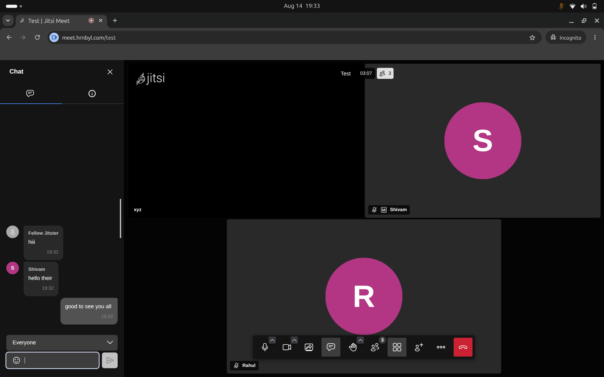

The screenshot above shows a **live multi-participant meeting** at `meet.hrnbyl.com/test`:

- **3 active participants** (xyz, Shivam, Rahul) in a room named "Test"
- **Active chat sidebar** with real-time messages between participants
- **Meeting duration** timer visible (03:07)
- **Full meeting controls** — microphone, camera, screen share, chat, raise hand, participants, tile view, and moderator options
- **Browser address bar** confirms the domain: `meet.hrnbyl.com/test` with HTTPS lock icon

### Smoke Tests

| Test | Method | Expected Result | Status |
|:-----|:-------|:---------------|:-------|
| Pod Health | `kubectl get pods -n jitsi` | All 5 pods show `1/1 Running` | ✅ Passed |
| Ingress Health | `kubectl get ingress -n jitsi` | ADDRESS populated with ALB hostname | ✅ Passed |
| DNS Resolution | `dig meet.hrnbyl.com` | Resolves to ALB endpoint | ✅ Passed |
| Web UI | Navigate to `https://meet.hrnbyl.com` | Landing page loads with valid HTTPS | ✅ Passed |
| Room Creation | Enter room name | Room opens, video/audio initializes | ✅ Passed |
| Multi-User | Join from second device | Both participants see and hear each other | ✅ Passed |
| Chat | Send message in meeting | Messages appear for all participants | ✅ Passed |
| ArgoCD Sync | Check Argo CD dashboard | App Healthy, Synced, 0 OutOfSync | ✅ Passed |

---

## 14. Troubleshooting & Engineering Challenges

> **Source:** [`jitsi-infra/docs/issues.md`](jitsi-infra/docs/issues.md)

### 14.1 Pod Scheduling — ENI Density Limits

**Problem:** Pods stuck in `Pending` state with `0/4 nodes are available: 4 Too many pods`.

**Root Cause:** `t3.micro` instances support a maximum of 4 pods per node. Kubernetes system pods consumed all available slots before application pods could be scheduled.

**Resolution:** Upgraded instance type to provide sufficient pod capacity. The current `m7i-flex.large` configuration with `--max-pods=110` bootstrap override eliminates this constraint entirely.

### 14.2 vCPU Quota Exhaustion

**Problem:** `VcpuLimitExceeded` error during Terraform apply when upgrading node sizes.

**Root Cause:** AWS Free Tier enforces an 8 vCPU soft limit per region. Terraform's "Create Before Destroy" strategy attempted to provision new nodes while old ones were still running, exceeding the quota.

**Resolution:** Reduced node count to 2, performed targeted `terraform destroy` of old nodes first, then applied the new configuration within the vCPU budget.

### 14.3 WebSocket 502 & Port Mismatch

**Problem:** Jitsi UI loaded but immediately displayed "Disconnected - Reconnecting" with `502 Bad Gateway` on `/xmpp-websocket`.

**Root Cause:** The web container's Nginx was configured to proxy WebSocket traffic to Prosody on port **5222** (raw TCP XMPP). Prosody's HTTP/WebSocket listener runs on port **5280**.

**Resolution:** Updated `XMPP_BOSH_URL_BASE` to target `http://jitsi-prosody.jitsi.svc.cluster.local:5280` and ensured Prosody's deployment template exposes `containerPort: 5280`.

### 14.4 XMPP Domain "Split Personality"

**Problem:** WebSocket connections entered a "Reconnecting" loop with `<host-unknown>` XMPP stream errors. Prosody logs showed `Communication with remote domains is not enabled`.

**Root Cause:** The web client sent XMPP handshakes using the public domain (`meet.hrnbyl.com`), but internal XMPP domain variables (`authDomain`, `mucDomain`) were set to the default placeholder `meet.jitsi`. Prosody treated requests for the public domain as unauthorized external server-to-server connections.

**Resolution:** Unified all XMPP domain variables in `values.yaml` to derive from the public domain:
```yaml
xmpp:
  authDomain: "auth.meet.hrnbyl.com"
  mucDomain: "muc.meet.hrnbyl.com"
  internalMucDomain: "internal-muc.meet.hrnbyl.com"
```

### 14.5 JVB & Jicofo Registration Failures

**Problem:** "Join meeting" button remained greyed out and unclickable.

**Root Cause:** JVB was missing the `XMPP_SERVER` environment variable entirely (defaulting to `xmpp.meet.jitsi` — a non-existent DNS record). Jicofo was using short Kubernetes DNS names that failed to resolve in Alpine-based containers.

**Resolution:** Explicitly injected `XMPP_SERVER: jitsi-prosody.jitsi.svc.cluster.local` into both `jvb-deployment.yaml` and `jicofo-deployment.yaml`, along with all required XMPP domain variables.

---

## 15. Design Decisions & Lessons Learned

| Decision | Rationale |
|:---------|:---------|
| **IP target-type** for both ALB and NLB | Bypasses kube-proxy iptables, routing directly to pod IPs. Critical for UDP media latency on JVB. |
| **Single NAT Gateway** | Cost optimization. Acceptable for non-HA workloads; production would use one NAT per AZ. |
| **FQDN over short DNS names** | Alpine-based containers (used by Jitsi images) have inconsistent `/etc/resolv.conf` search domains. FQDNs eliminate DNS resolution ambiguity. |
| **`m7i-flex.large` with max-pods=110** | Provides sufficient CPU/RAM headroom and pod capacity without hitting ENI-based pod limits. |
| **Unified XMPP domains** | Prevents the "split personality" issue where Prosody rejects internal traffic because domain names don't match across components. |
| **Fail-safe VPC cleanup** in destroy script | AWS Load Balancer-managed ENIs can outlive `terraform destroy`, permanently blocking VPC deletion. The manual cleanup loop guarantees a clean account state. |
| **Helm chart** instead of raw manifests | Enables parameterized deployments, version tracking via `helm history`, and one-command rollbacks via `helm rollback`. |
| **JVB at 2 replicas** | Provides basic media routing redundancy. Jicofo distributes conferences across available JVB instances. |

---

## 16. Production Recommendations

The following improvements are **not currently implemented** but are recommended for a production deployment:

| Category | Recommendation |
|:---------|:-------------|
| **Secrets** | Migrate XMPP passwords from plaintext `values.yaml` to Kubernetes Secrets or AWS Secrets Manager (CSI driver) |
| **Autoscaling** | Add Horizontal Pod Autoscaler (HPA) for JVB based on CPU/connection metrics |
| **High Availability** | Deploy NAT Gateways in each AZ. Run Prosody as a StatefulSet with persistent storage |
| **Network Policies** | Implement Kubernetes NetworkPolicies to restrict pod-to-pod communication to required paths only |
| **Pod Disruption Budgets** | Define PDBs for Prosody and JVB to prevent simultaneous evictions during node maintenance |
| **TURN/STUN** | Deploy a TURN server (e.g., coturn) for clients behind restrictive NATs that cannot establish direct UDP connections |
| **In-Cluster Monitoring** | Migrate Grafana/Loki/OTel from Docker Compose to Kubernetes manifests inside EKS for unified management |
| **Resource Limits** | Define CPU/memory requests and limits on all Jitsi containers to enable proper scheduling and prevent resource contention |
| **ArgoCD App-of-Apps** | Commit the Argo CD `Application` manifest to Git for fully declarative GitOps |
| **Backup** | Implement Velero for Kubernetes resource backup and disaster recovery |

---

## 17. Project File Reference

```
hrnbyl-meet/
├── .github/workflows/
│   ├── cd-deploy.yml              # GitHub Actions: Full infrastructure deployment
│   ├── cd-destroy.yml             # GitHub Actions: Full infrastructure teardown
│   ├── ci-build.yml               # GitHub Actions: Docker image build + push
│   └── ci.yml                     # GitHub Actions: Lint + build verification
│
├── jitsi-infra/
│   ├── terraform/
│   │   ├── providers.tf           # AWS, Kubernetes, Helm provider config
│   │   ├── variables.tf           # Input variables (region, cluster name, CIDR)
│   │   ├── vpc.tf                 # VPC, subnets, NAT, IGW, subnet tags
│   │   ├── eks.tf                 # EKS cluster + managed node group
│   │   ├── dns.tf                 # ACM certificate for meet.hrnbyl.com
│   │   ├── output.tf              # Cluster endpoint, name, VPC ID outputs
│   │   └── backend.tf             # S3 remote state backend
│   │
│   ├── helm/jitsi-chart/
│   │   ├── Chart.yaml             # Helm chart metadata (v0.1.0)
│   │   ├── values.yaml            # Global config: domain, images, secrets, XMPP domains
│   │   └── templates/
│   │       ├── ingress.yaml       # ALB Ingress (HTTPS, SSL redirect, ACM cert)
│   │       ├── web-deployment.yaml    # jitsi-web Deployment + ClusterIP Service
│   │       ├── prosody-deployment.yaml # Prosody Deployment + ClusterIP Service
│   │       ├── jicofo-deployment.yaml  # Jicofo Deployment
│   │       ├── jvb-deployment.yaml     # JVB Deployment (2 replicas)
│   │       └── jvb-service.yaml        # JVB NLB Service (UDP 10000)
│   │
│   ├── iam_policy.json            # Combined ALB + Route53 IAM policy
│   └── docs/
│       ├── deployment_guide.md    # Detailed deployment reference
│       └── issues.md              # Post-mortem troubleshooting log
│
├── log-analyser/
│   ├── grafana-provisioning/
│   │   ├── dashboards/            # Pre-built Grafana dashboards (Jicofo, JVB, Web, Prosody)
│   │   └── datasources/           # Loki + Prometheus datasource config
│   ├── loki/                      # Loki configuration
│   └── otel-collector-config.yaml # OpenTelemetry Collector pipeline
│
├── resources/
│   ├── jitsi-host.png             # Live meeting screenshot
│   ├── argocd-graph.png           # Argo CD resource graph
│   ├── grafana-jvb.png            # JVB Grafana dashboard
│   ├── grafana-jitsi-web.png      # Web Grafana dashboard
│   ├── grafana-prososdy.png       # Prosody Grafana dashboard
│   ├──  grafana-jicofo.png        # Jicofo Grafana dashboard
│   ├── docker-jitsi-meet.png      # Official Jitsi architecture reference
│   └── logo.svg                   # Jitsi project logo
│
├── web/                           # Jitsi Web container (Dockerfile + rootfs)
├── prosody/                       # Prosody container configuration
├── jicofo/                        # Jicofo container configuration
├── jvb/                           # JVB container configuration
│
├── deploy.sh                      # One-command full deployment script
├── pause.sh                       # Cost-saving EKS + NAT teardown (preserves VPC)
├── destroy-all.sh                 # Complete infrastructure nuke with fail-safe
├── docker-compose.yml             # Local development Docker Compose
├── grafana.yml                    # Grafana Docker Compose overlay
└── DEVOPS.md                      # This documentation
```

---

<p align="center">
  <b>Built by Rahul Bastia</b><br/>
  <i>DevOps Engineer · Cloud Architect · Kubernetes Engineer</i>
</p>
